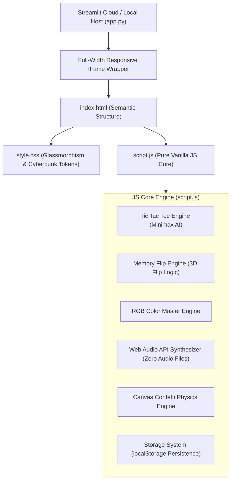

<div align="center">

# 🎮 Mini Game Hub

### *A Production-Quality Cyberpunk Arcade Suite Built with Vanilla Web Technologies & Streamlit Container*

[](https://mini-game-app-axhmkagzmyjv7abeqeuvwg.streamlit.app/)
[](https://github.com/Dhanya562004/Mini-Game-Hub)
[](https://developer.mozilla.org/en-US/docs/Web/HTML)
[](https://developer.mozilla.org/en-US/docs/Web/CSS)
[](https://developer.mozilla.org/en-US/docs/Web/JavaScript)
[](LICENSE)

---

### 🚀 [**Click Here to Experience the Live Application**](https://mini-game-app-axhmkagzmyjv7abeqeuvwg.streamlit.app/)

</div>

---

## 🌟 Overview

**Mini Game Hub 🎮** is a modern, high-fps web application featuring three classic arcade games packed into a glassmorphic dashboard interface. 

The application architecture cleanly decouples the **Frontend Core (Pure HTML5, CSS3, ES6 JavaScript)** from the **Deployment Wrap (Streamlit Container)**. All game logic, animations, Minimax AI decision trees, audio synthesis, and score persistence execute client-side in native JavaScript.

---

## 🎮 Included Arcade Suite

### 1. ❌ Tic Tac Toe (Strategy & Minimax AI)
- **3 Dynamic Modes**: 👥 Local 2-Player (PvP), 🤖 Easy AI, and **⚡ Unbeatable Minimax AI**.
- **Minimax AI Engine**: Evaluates recursive decision trees ($10 - \text{depth}$ vs $\text{depth} - 10$) to ensure mathematically optimal gameplay.
- **Visual Feedback**: Neon glowing SVG markers, automated win combination highlight animations, and instant scoreboard tracking.

### 2. 🎴 Memory Card Match (Visual Recall & Speed)
- **3 Difficulty Grid Presets**:
  - 🟢 **Easy**: 4x3 Grid (6 Emoji Pairs)
  - 🟡 **Medium**: 4x4 Grid (8 Emoji Pairs)
  - 🔴 **Hard**: 6x4 Grid (12 Emoji Pairs)
- **3 Theme Packs**: 👾 Gaming Icons, 🦄 Emojis, and 🍕 Delicious Food.
- **3D Card Flip**: Built with hardware-accelerated CSS 3D transforms (`perspective: 1000px`, `transform-style: preserve-3d`).
- **Star Rating System**: Computes performance score based on total move efficiency and elapsed time.

### 3. 🎨 RGB Color Master (Color Vision & Memory)
- **Game Modes**: 🟢 Easy (3 Swatches) vs 🔴 Hard (6 Swatches).
- **Random Target Generator**: Calculates precise target RGB codes e.g., `RGB(246, 211, 101)` alongside algorithmically tuned distractor color shades.
- **Streak Tracker**: Tracks live consecutive win streaks and persistent high-score records.

---

## 🛠️ Architecture & Tech Stack



| Component | Technology | Description |
| :--- | :--- | :--- |
| **Frontend Structure** | HTML5 | Semantic markup with multi-view layout containers (`view-home`, `view-tictactoe`, `view-memory`, `view-color`). |
| **Styling & UI** | CSS3 (Vanilla) | Custom CSS properties, glassmorphism backdrop filters, 3D card flips, neon glow variables, and dynamic grid layouts. |
| **Logic & Engines** | JavaScript (ES6+) | Modular game controllers, recursive Minimax AI, state machines, and local storage management. |
| **Sound Synthesis** | Web Audio API | Standard browser `AudioContext` frequency synthesizer (Click, Flip, Match, Win, Wrong sounds) — **0 external audio files needed**. |
| **FX & Particle Engine**| HTML5 Canvas API | Custom particle physics engine rendering victory confetti explosions. |
| **Deployment Wrap** | Streamlit (`app.py`) | Python container serving the frontend full-width using `streamlit.components.v1.html()`. |

---

## 💎 UI/UX & Design Highlights

- 🌌 **Cyberpunk Dark Glassmorphism**: Deep radial glow gradients (`#090c15`), translucent card backdrops, subtle glass borders, and smooth transitions.
- 📱 **Fully Responsive Layout**: Flexbox & Grid breakpoint styling optimized across mobile (<480px), tablet (<768px), and high-res desktop (>1200px) viewports.
- 🔊 **Web Audio Sound Effects**: Interactive sound toggle in top header with synthesized tone frequency chimes.
- 💾 **Automatic Persistence**: All high scores, win streaks, game counts, and mute preferences persist seamlessly via browser `localStorage`.

---

## 📁 Project Structure

```
Mini-Game-Hub/
├── 📄 app.py              # Streamlit container & full-width iframe wrapper
├── 📄 index.html          # Semantic HTML layout and game views
├── 🎨 style.css           # Glassmorphism styling system & animations
├── ⚡ script.js           # Game logic, Minimax AI, Audio Synthesizer & Confetti
├── 📋 requirements.txt    # Python dependencies (Streamlit)
├── 📁 assets/             # Assets & documentation directory
└── 📖 README.md           # Comprehensive project documentation
```

---

## 🚀 Local Setup & Installation

### Option 1: Run via Streamlit Container (Recommended)

1. **Clone the Repository**:
   ```bash
   git clone https://github.com/Dhanya562004/Mini-Game-Hub.git
   cd Mini-Game-Hub
   ```

2. **Install Python Dependencies**:
   ```bash
   pip install -r requirements.txt
   ```

3. **Launch the Streamlit App**:
   ```bash
   streamlit run app.py
   ```

4. **Access in Browser**:
   Open `http://localhost:8501` or the port displayed in your terminal.

---

### Option 2: Standalone Web Browser (No Python Required)

Double click [`index.html`](file:///c:/Users/Deeksha/OneDrive/Desktop/Mini%20game%20hub/index.html) or open it directly in Google Chrome, Edge, Safari, or Firefox!

---

## 🔗 Live Deployment

- **Streamlit Cloud App**: [https://mini-game-app-axhmkagzmyjv7abeqeuvwg.streamlit.app/](https://mini-game-app-axhmkagzmyjv7abeqeuvwg.streamlit.app/)
- **GitHub Repository**: [https://github.com/Dhanya562004/Mini-Game-Hub](https://github.com/Dhanya562004/Mini-Game-Hub)

---

## 📜 License

This project is licensed under the [MIT License](LICENSE) - feel free to use, modify, and distribute.

<div align="center">
  <br>
  <sub>Crafted with ❤️ using Pure HTML, CSS, JavaScript & Streamlit</sub>
</div>
